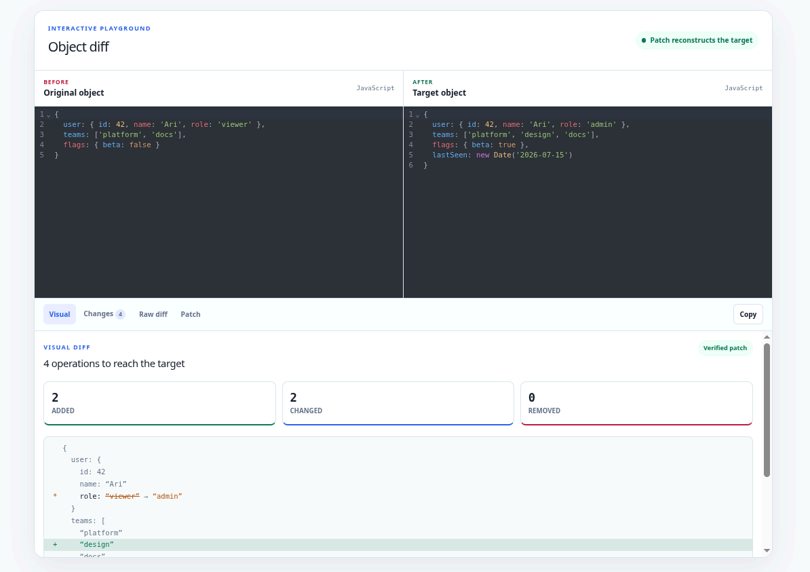

<div align="center">

# @opentf/obj-diff

**The Fast, Accurate, and Modern JavaScript Objects Diffing & Patching Library.**

[](https://github.com/Open-Tech-Foundation/obj-diff/actions/workflows/build.yml)
[](https://jsr.io/@opentf/obj-diff)



[**Live Demo**](https://obj-diff.pages.dev/) | [**Report Bug**](https://github.com/Open-Tech-Foundation/obj-diff/issues) | [**Standard Library**](https://github.com/Open-Tech-Foundation/std)

</div>

---

## 🚀 Features

- 🔍 **Deep Objects Diffing**: Detects changes at any depth.
- 🩹 **Efficient Patching**: Apply diffs to recreate target objects.
- 🛠️ **Extensible**: Support for custom object types via `diffWith()`.
- 📦 **Modern Ecosystem**: Built for Bun, Node.js, Deno, and Browser.
- 🟦 **TypeScript Native**: Full type safety and autocompletion.
- ⚡ **High Performance**: Optimized for speed and minimal memory footprint.

## 📦 Installation

Install `@opentf/obj-diff` using your preferred package manager:

```sh
# Bun
bun add @opentf/obj-diff

# pnpm
pnpm add @opentf/obj-diff

# npm
npm install @opentf/obj-diff

# Deno
deno add @opentf/obj-diff
```

## 🛠 Supported Types

The library natively supports the following types:

- **Primitives**: `Undefined`, `Null`, `Number`, `String`, `Boolean`, `BigInt`.
- **Built-in Objects**: `Plain Objects {}`, `Array`, `Date`, `Map`, `Set`.

## 📖 Usage

### `diff(obj1, obj2)`

Performs a deep comparison between two objects.

```ts
import { diff } from '@opentf/obj-diff';

const result = diff(obj1, obj2);
```

#### `DiffResult` Structure
```ts
type DiffResult = {
  type: 0 | 1 | 2;              // 0: Deleted, 1: Created, 2: Updated
  path: Array<string | number>; // The path to the property
  value?: unknown;              // The value (for Created/Updated)
};
```

### `patch(obj, patches)`

Applies an array of diff results to an object.

```ts
import { patch } from "@opentf/obj-diff";

const updatedObj = patch(originalObj, diffResults);
```

---

## 💡 Examples

### 1. Basic Objects
```js
const a = { a: 1, b: 2 };
const b = { a: 2, c: 3 };

diff(a, b);
/*
[
  { type: 2, path: ["a"], value: 2 },
  { type: 0, path: ["b"] },
  { type: 1, path: ["c"], value: 3 }
]
*/
```

### 2. Nested Structures
```js
const a = { foo: { bar: [1, 2] } };
const b = { foo: { bar: [1] } };

const d = diff(a, b);
const res = patch(a, d); // res is deep equal to b
```

### 3. ES6 Map & Set Support
Natively diff and patch modern collections.

```js
const a = new Set([1, 2]);
const b = new Set([2, 3]);

diff(a, b);
/*
[
  { type: 0, path: [0], value: 1 },
  { type: 1, path: [1], value: 3 }
]
*/
```

### 4. Circular Reference Safety
Safe comparison of recursive objects without infinite loops.

```js
const a = { id: 1 };
a.self = a;
const b = { id: 2 };
b.self = b;

diff(a, b); 
// Output: [{ type: 2, path: ["id"], value: 2 }]
```

### 5. Custom Types via `diffWith()`
Extend the diffing logic for specialized types like MongoDB `ObjectId`.

```js
import { diffWith } from "@opentf/obj-diff";
import { ObjectId } from "bson";

const result = diffWith(record1, record2, (a, b) => {
  if (a instanceof ObjectId && b instanceof ObjectId) {
    return a.toString() !== b.toString();
  }
});
```

---

## ⚠️ Caveats

### Internal Object Sharing (Aliasing)

For maximum performance, `@opentf/obj-diff` preserves internal object identity (sharing) during the `patch()` operation. 

If your original object contains multiple paths pointing to the **same object instance**, patching one of those paths will affect all its aliases.

```js
const shared = { x: 1 };
const a = { first: shared, second: shared };
const b = { first: { x: 1 }, second: { x: 2 } };

const d = diff(a, b);
const res = patch(a, d);

// res.first.x will be 2 because it shares the same instance as res.second
console.log(res.first.x); // 2
```

> [!TIP]
> If you require independent branches after patching, ensure your input objects do not share internal references that are expected to diverge.

---

## 📊 Benchmark

We prioritize performance without sacrificing accuracy.

| Library | Ops/sec | Average Time | Notes |
| :--- | :--- | :--- | :--- |
| **@opentf/obj-diff** | **246,154** | **~4.0μs** | **Fastest; Full Diff + Patch support.** |
| microdiff | 158,745 | ~6.3μs | Very fast; No patching support. |
| jsondiffpatch | 157,453 | ~6.3μs | Rich features (LCS, RFC6902); Slower. |
| deep-object-diff | 151,559 | ~6.6μs | Fast; Basic diffing only. |
| deep-diff | 111,615 | ~9.0μs | Medium; Classic library. |
| recursive-diff | 79,628 | ~12.5μs | Slower; Good for complex recursion. |
| just-diff | 66,477 | ~15.0μs | Slowest in this test. |

### Running Benchmarks Locally
```sh
bun run build
bun benchmark.js
```

---

## ❓ FAQs

### 1. Why is JSON Patch (RFC 6902) not supported?
The JSON Patch protocol is quite heavy and complex. We've optimized `@opentf/obj-diff` for performance and simplicity, which covers the vast majority of real-world use cases.

### 2. What does an empty path `path: []` mean?
An empty path denotes the **Root** of the object. It typically means the entire source was replaced by the target value (e.g., comparing an object to `null`).

---

## 📖 Articles

Explore the philosophy behind our standard library:
- [Introducing Our New JavaScript Standard Library](https://ganapathy.hashnode.dev/introducing-our-new-javascript-standard-library)
- [You Don’t Need JavaScript Native Methods](https://ganapathy.hashnode.dev/you-dont-need-javascript-native-methods)

---

## 📄 License

This project is licensed under the [MIT License](./LICENSE).
